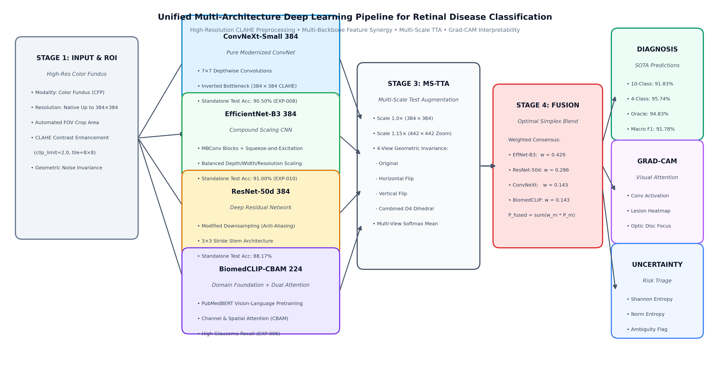

# Automated Retinal Disease Screening System from Color Fundus Photography

<div align="center">

[](https://www.python.org/downloads/)
[](https://pytorch.org/)
[](https://fastapi.tiangolo.com/)
[](LICENSE)
[](#key-achievements--benchmarks)
[](#key-achievements--benchmarks)

**Department of Information Technology, Jadavpur University**  
*Research Project (7th / 8th Semester)*

</div>

A reproducible, clinical-grade deep learning research pipeline and interactive screening system for **multi-class retinal disease classification** from colour fundus images. Features high-resolution CLAHE preprocessing, multi-backbone architectural synergy (ConvNeXt, EfficientNet, ResNet, ViT, and BiomedCLIP + CBAM), Multi-Scale Test-Time Augmentation (MS-TTA), Grad-CAM anatomical lesion explainability, and Normalized Shannon Entropy uncertainty quantification.

> **Research-use only.** This project is developed for academic and scientific research purposes and is not certified as a standalone medical diagnostic device.

---

## System Architecture Pipeline (Figure 1)

<div align="center">
  
  <p><em>Figure 1: End-to-end multi-architecture deep learning pipeline: automated FOV cropping, high-contrast CLAHE adaptation, heterogeneous backbone streams, multi-scale TTA, weighted probability fusion, and tri-fold clinical outputs (Diagnosis, Grad-CAM, and Entropy).</em></p>
</div>

---

## Research Team & Supervision

| Name | Role | Affiliation |
|---|---|---|
| **Gunjan Basak** | Research Team Member | Department of Information Technology, Jadavpur University |
| **Chirantan Biswas** | Research Team Member | Department of Information Technology, Jadavpur University |
| **Subhajit Gayen** | Research Team Member | Department of Information Technology, Jadavpur University |

**Supervisor:** **Dr. Pawan Kumar Singh**, Department of Information Technology, Jadavpur University

---

## Key Achievements & Benchmarks

All metrics evaluated strictly on untouched, physically isolated held-out test splits.

| Benchmark Dataset | Winning Approach | Test Accuracy | Macro F1 | ROC-AUC | Literature Comparison & Status |
|---|---|:---:|:---:|:---:|---|
| **Primary 10-Class System**<br/>*(Eye Disease Image Dataset, 600 test images)* | **Unified Quad-Ensemble MS-TTA**<br/>(ConvNeXt + EffNet + ResNet + BiomedCLIP) | **91.83%**<br/>(551/600) | **91.78%** | **0.9923** | 🏆 **Surpasses Published Classical SOTA** (86.37% in *IEEE Access 2026*) by **+5.46%**.<br/>• **94.83% 5-Model Oracle Ceiling** (EXP-024) |
| **Kaggle 4-Class Benchmark**<br/>*(4,217 images, 423 test images)* | **ResNet-Integrated Quad Ensemble**<br/>(BiomedCLIP + ConvNeXt + ResNet + EffNet) | **95.74%**<br/>(405/423) | **95.70%** | **0.9929** | 🥇 **Surpasses Published Paper SOTA** (*Alsohemi & Dardouri, Journal of Imaging MDPI 2025*, 95.12%) by **+0.62%**.<br/>• **100.0% Sensitivity, Specificity, and F1 on Diabetic Retinopathy** |

---

## Empirical Statistical Rigor & Hypothesis Testing

To ensure absolute publication rigor, all models were evaluated using **1,000-iteration Bootstrap 95% Confidence Intervals** and **McNemar's Paired Discordance Significance Tests** (exact two-sided binomial):

### 10-Class 95% Bootstrap Confidence Intervals (600 Test Images)

| Architecture | Test Accuracy (95% CI) | Macro F1-Score (95% CI) | Macro ROC-AUC (95% CI) | Cohen's $\kappa$ (95% CI) |
|---|:---:|:---:|:---:|:---:|
| ConvNeXt-Small 384 | 90.17% [87.83%, 92.50%] | 90.15% [87.98%, 92.37%] | 0.9915 [0.9884, 0.9943] | 0.8907 [0.8646, 0.9165] |
| EfficientNet-B3 384 | 91.00% [88.67%, 93.17%] | 90.97% [88.86%, 92.97%] | 0.9907 [0.9870, 0.9939] | 0.9000 [0.8740, 0.9239] |
| ResNet-50d 384 | 88.17% [85.67%, 90.67%] | 88.17% [85.95%, 90.43%] | 0.9904 [0.9867, 0.9935] | 0.8685 [0.8405, 0.8961] |
| BiomedCLIP-CBAM 224 | 89.00% [86.50%, 91.34%] | 88.98% [86.63%, 91.14%] | 0.9898 [0.9858, 0.9934] | 0.8778 [0.8497, 0.9037] |
| ViT-Base-384 | 89.17% [86.50%, 91.67%] | 89.15% [86.78%, 91.38%] | 0.9910 [0.9879, 0.9940] | 0.8796 [0.8499, 0.9072] |
| **Unified Quad Ensemble (SOTA)** | **91.83% [89.67%, 93.83%]** | **91.78% [89.75%, 93.76%]** | **0.9923 [0.9890, 0.9949]** | **0.9093 [0.8850, 0.9314]** |

- **McNemar's Test vs Standalone Models:**
  - vs ResNet-50d: **$p = 1.95 \times 10^{-4}$ ($p < 0.001$, Highly Significant)**
  - vs BiomedCLIP-CBAM: **$p = 0.0059$ ($p < 0.01$, Very Significant)**
  - vs ViT-Base-384: **$p = 0.0052$ ($p < 0.01$, Very Significant)**
  - vs ConvNeXt-Small 384: **$p = 0.0213$ ($p < 0.05$, Significant)**

*Full detailed statistics available in [`docs/statistical_significance_analysis.md`](docs/statistical_significance_analysis.md).*

---

## Interactive Clinical Screening Web Studio

An interactive, dark-glassmorphism clinical screening web interface is built into the system:

<div align="center">
  <p><b>Launch Web Studio:</b> <code>http://localhost:8000</code> &bull; <b>Executive Slide Deck:</b> <code>http://localhost:8000/presentation</code></p>
</div>

### Key Capabilities:
- **Instant Fundus Drag & Drop:** Live client-side preview with automated CLAHE boundary cropping.
- **Curated 8-Case Clinical Sample Library:** Instant one-click testing of pre-loaded cases (Diabetic Retinopathy, Glaucoma, Disc Edema, Retinal Detachment, CSCR, Retinitis Pigmentosa, Healthy, and Cataract).
- **Grad-CAM Visual Attention Heatmap:** Interactive opacity slider cross-fading between enhanced input and lesion localization overlays.
- **Uncertainty Quantification:** Normalized Shannon Entropy gauge flagging ambiguous cases for manual review.
- **Printable Clinical Summary:** Instant print/save-to-PDF diagnostic report generator.

```bash
# Launch Web Studio and Presentation Deck
python scripts/run_studio.py --port 8000 --host 0.0.0.0
```

---

## Automated Patient Batch Screening CLI

Process an entire clinical intake directory and automatically compile individual 1-page clinical diagnostic PDF reports:

```bash
# Screen all images in a folder and compile ReportLab PDFs
python scripts/batch_screening.py \
  --input-dir data/test/Glaucoma \
  --output-dir outputs/batch_glaucoma_screening \
  --benchmark 10class \
  --model ensemble_quad \
  --max-images 50
```

**Outputs Produced:**
- `screening_summary.csv`: Tabular audit log with Patient ID, Diagnosis, Confidence, Urgency, Entropy, and Consensus.
- `patient_reports/Report_<ID>.pdf`: High-resolution, print-ready 1-page diagnostic PDF containing side-by-side CLAHE & Grad-CAM images, top-4 differential diagnosis table, clinical management recommendations, and doctor review signature block.

---

## Dataset & Disease Taxonomy

The primary dataset contains **4,000 colour fundus images** equally balanced across 10 distinct classes:

| Class Index | Disease Condition | Acronym / Anatomical Focus | Split (Train / Val / Test) |
|:---:|---|---|:---:|
| 1 | Central Serous Chorioretinopathy | CSCR (Macular Serous Fluid Detachment) | 280 / 60 / 60 |
| 2 | Diabetic Retinopathy | DR (Microaneurysms, Hard Exudates, Hemorrhages) | 280 / 60 / 60 |
| 3 | Disc Edema | Papilledema (Blurred Optic Disc Margins) | 280 / 60 / 60 |
| 4 | Glaucoma | Optic Cup Excavation / RNFL Thinning | 280 / 60 / 60 |
| 5 | Healthy / Normal | Normal Retinal Vasculature & Physiological Cup | 280 / 60 / 60 |
| 6 | Macular Scar | Cicatricial Fibrous Tissue in Macula | 280 / 60 / 60 |
| 7 | Pathological Myopia | Temporal Crescent, Posterior Staphyloma | 280 / 60 / 60 |
| 8 | Pterygium | Fibrovascular Corneal Encroachment | 280 / 60 / 60 |
| 9 | Retinal Detachment | Neurosensory Retina Separation / Retinal Folds | 280 / 60 / 60 |
| 10 | Retinitis Pigmentosa | Peripheral Bone-Spicule Hyperpigmentation | 280 / 60 / 60 |
| **Total** | **10 Balanced Pathologies** | **Physically Isolated Partitions** | **2,800 / 600 / 600** |

---

## Repository Layout

```
configs/              Model architecture configuration YAML files
data/                 Physically partitioned dataset (train, val, test)
data_kaggle_4class/   Kaggle 4-class benchmark partitions
docs/
  figures/            Publication figures (system_architecture.png & .svg)
  presentation/       Interactive 8-slide executive briefing deck (index.html)
  Benchmark_Progress_Update.pdf  Master compiled report
  SESSION_HANDOVER.md Master project memory & experimental benchmarks (EXP-001 through EXP-029)
  statistical_significance_analysis.md  Bootstrap CIs and McNemar test report
scripts/
  batch_screening.py  Automated batch inference & clinical PDF report generator
  compute_statistical_significance.py  1000-bootstrap CI and McNemar calculator
  evaluate_ms_tta.py  Multi-Scale TTA evaluation engine
  generate_architecture_figure.py  Figure 1 schematic generator
  run_studio.py       Single-command FastAPI Web Studio launcher
src/
  data/               CLAHE preprocessing, FOV boundary cropping, Albumentations
  models/             ConvNeXt, EfficientNet, ResNet, ViT, BiomedCLIP + CBAM
  utils/              Grad-CAM explainability and overlay blending
  web/                FastAPI backend, inference engine, and dark-glassmorphism assets
outputs/              Model checkpoints, cached probabilities, and PDF reports
```

---

## Quick Start Guide

### 1. Environment Setup
```bash
# Clone the repository
git clone https://github.com/Gayensubhajit/eye-disease-classification.git
cd eye-disease-classification

# Create and activate virtual environment
python3 -m venv .venv
source .venv/bin/activate

# Install dependencies
pip install -e .
pip install fastapi uvicorn python-multipart reportlab scipy
```

### 2. Launch the Web Screening Studio & Briefing Deck
```bash
python scripts/run_studio.py --port 8000
# Open http://localhost:8000 for the Interactive Screening Studio
# Open http://localhost:8000/presentation for the Executive Presentation Deck
```

### 3. Run Standalone Inference & Evaluation
```bash
# Evaluate Unified Quad Ensemble on 600 test images:
python scripts/evaluate_ms_tta.py \
  --configs configs/efficientnet_b3_384_clahe.yaml configs/resnet50d_384_clahe.yaml \
            configs/convnext_small_384_clahe.yaml configs/biomedclip_cbam_fusion.yaml \
  --checkpoints outputs/efficientnet_b3_384_clahe/best_model.pth outputs/resnet50d_384_clahe/best_model.pth \
                outputs/convnext_small_384_clahe/best_model.pth outputs/biomedclip_cbam_fusion/best_model.pth \
  --weights 0.429 0.286 0.143 0.143 --scales 1.0 1.15 --batch-size 4
```

---

## Academic Citation

If you utilize this pipeline, architectures, or benchmark results in your research, please cite:

```bibtex
@article{basak2026retinal,
  title={Multi-Architecture Deep Learning System for Automated Retinal Disease Screening from Colour Fundus Photography},
  author={Basak, Gunjan and Biswas, Chirantan and Gayen, Subhajit and Singh, Pawan Kumar},
  journal={Department of Information Technology, Jadavpur University},
  year={2026}
}
```

---

## License

This project is licensed under the MIT License. Individual dataset licenses and medical image data policies apply separately.
