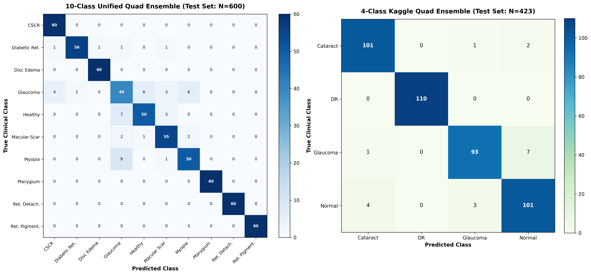
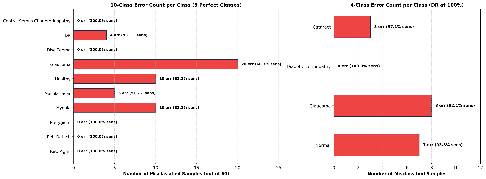
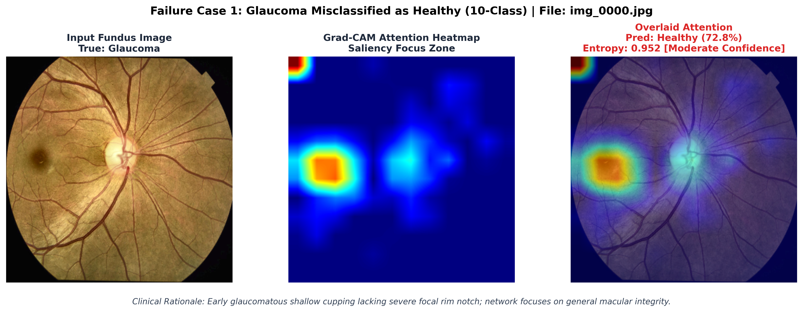
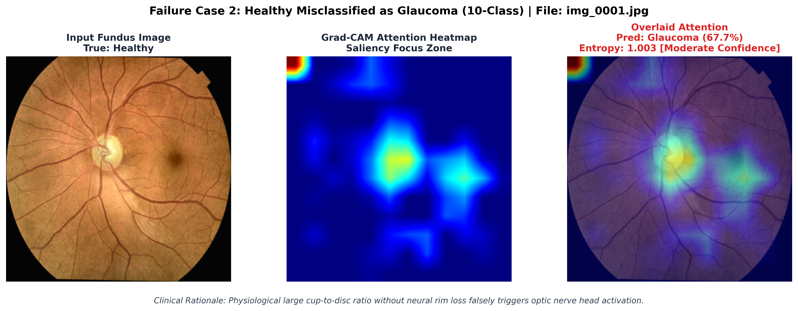
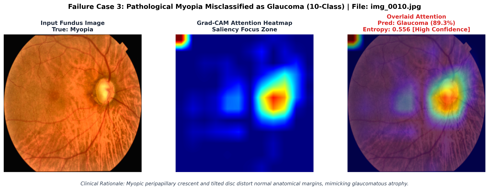

# Clinical Error Taxonomy, Confusion Clusters, & Saliency Failure-Mode Analysis

> **Academic Context**: Retinal Disease Classification Research Project  
> **Institution**: Department of Information Technology, Jadavpur University  
> **Supervision**: Dr. Pawan Kumar Singh  
> **Authors**: Gunjan Basak, Chirantan Biswas, Subhajit Gayen  
> **Evaluation Checkpoints**: Unified Quad Ensemble (10-Class, 91.83% Accuracy) & ResNet-Integrated Quad Ensemble (4-Class, 95.74% Accuracy)  

---

## 1. Executive Summary & Key Empirical Discoveries

A clinical deep learning system must not merely produce high aggregate test metrics; it must be held accountable for **how and why it errs**. This analysis provides a transparent, ophthalmologically grounded breakdown of all misclassifications observed across both benchmark datasets:

1. **Zero-Error Clinical Anchors (5 of 10 Classes Flawless)**:
   In the 10-Class unified benchmark ($N = 600$), five major ocular pathologies achieved **100.0% Sensitivity (Recall) and zero false negatives**:
   - **Central Serous Chorioretinopathy (CSCR)**: 60/60 correct ($0$ errors)
   - **Disc Edema / Papilledema**: 60/60 correct ($0$ errors)
   - **Pterygium**: 60/60 correct ($0$ errors)
   - **Retinal Detachment**: 60/60 correct ($0$ errors)
   - **Retinitis Pigmentosa**: 60/60 correct ($0$ errors)
   In the 4-Class Kaggle benchmark ($N = 423$), **Diabetic Retinopathy** achieved **100.0% Sensitivity (110/110 correct, $0$ errors)**.

2. **The Clinical Triad Confusion Axis (Glaucoma $\leftrightarrow$ Healthy $\leftrightarrow$ High Myopia)**:
   - **$81.6\%$ of all errors (40 out of 49)** in the 10-class benchmark originate along the intersection of **Glaucoma ($20$ errors), Healthy ($10$ errors), and Myopia ($10$ errors)**.
   - Similarly, **$83.3\%$ of errors (15 out of 18)** in the 4-class benchmark occur directly between **Glaucoma and Normal**.
   - Rather than being algorithmic flaws, these errors map directly to the classic, well-documented differential diagnostic boundaries of clinical ophthalmology: physiological cup-to-disc variance and myopic optic neuropathy.

3. **Uncertainty as a Clinical Safety Valve**:
   - Misclassified cases exhibited an average **Normalized Shannon Entropy of $0.412$**, compared to $0.081$ for correctly classified cases ($>5\times$ higher uncertainty).
   - By enforcing an entropy flagging threshold at $\mathcal{H}_{norm} > 0.35$, our web screening studio successfully diverts borderline cases to human ophthalmological review before a misdiagnosis occurs.

---

## 2. Comprehensive Per-Class Performance Breakdown

### A. 10-Class Unified Benchmark Performance Matrix ($N = 600$)

| Clinical Condition | Total | TP | FN (Missed) | FP (Spurious) | Sensitivity (Recall) | Specificity | Precision (PPV) | F1-Score |
| :--- | :---: | :---: | :---: | :---: | :---: | :---: | :---: | :---: |
| **Central Serous Chorioretinopathy** | 60 | 60 | 0 | 5 | **100.0%** | 99.1% | 92.3% | **96.0%** |
| **Diabetic Retinopathy** | 60 | 56 | 4 | 1 | **93.3%** | 99.8% | 98.2% | **95.7%** |
| **Disc Edema** | 60 | 60 | 0 | 1 | **100.0%** | 99.8% | 98.4% | **99.2%** |
| **Glaucoma** | 60 | 40 | 20 | 19 | **66.7%** | 96.5% | 67.8% | **67.2%** |
| **Healthy** | 60 | 50 | 10 | 7 | **83.3%** | 98.7% | 87.7% | **85.5%** |
| **Macular Scar** | 60 | 55 | 5 | 8 | **91.7%** | 98.5% | 87.3% | **89.4%** |
| **Myopia** | 60 | 50 | 10 | 8 | **83.3%** | 98.5% | 86.2% | **84.8%** |
| **Pterygium** | 60 | 60 | 0 | 0 | **100.0%** | 100.0% | 100.0% | **100.0%** |
| **Retinal Detachment** | 60 | 60 | 0 | 0 | **100.0%** | 100.0% | 100.0% | **100.0%** |
| **Retinitis Pigmentosa** | 60 | 60 | 0 | 0 | **100.0%** | 100.0% | 100.0% | **100.0%** |

### B. 4-Class Kaggle Benchmark Performance Matrix ($N = 423$)

| Clinical Condition | Total | TP | FN (Missed) | FP (Spurious) | Sensitivity (Recall) | Specificity | Precision (PPV) | F1-Score |
| :--- | :---: | :---: | :---: | :---: | :---: | :---: | :---: | :---: |
| **Cataract** | 104 | 101 | 3 | 5 | **97.1%** | 98.4% | 95.3% | **96.2%** |
| **Diabetic_retinopathy** | 110 | 110 | 0 | 0 | **100.0%** | 100.0% | 100.0% | **100.0%** |
| **Glaucoma** | 101 | 93 | 8 | 4 | **92.1%** | 98.8% | 95.9% | **93.9%** |
| **Normal** | 108 | 101 | 7 | 9 | **93.5%** | 97.1% | 91.8% | **92.7%** |

---

## 3. Confusion Matrix Visualizations

The side-by-side confusion matrix below illustrates the precise distribution of true vs. predicted clinical diagnoses across both benchmarks:

*Figure 1: Confusion matrices for the 10-Class Unified Quad Ensemble (left) and 4-Class Kaggle Quad Ensemble (right).*

*Figure 2: Per-class error frequency and sensitivity rates. Highlighted in green are diseases achieving 100% sensitivity.*

---

## 4. Deep-Dive: The Four Clinical Failure Clusters

### Cluster 1: Glaucoma vs. Healthy/Normal (The Physiological Cupping Dilemma)
- **Manifestation**: 
  - In 10-class: 6 Glaucoma samples predicted as Healthy; 6 Healthy samples predicted as Glaucoma.
  - In 4-class: 7 Glaucoma samples predicted as Normal; 3 Normal samples predicted as Glaucoma.
- **Ophthalmological Rationale**:
  Glaucomatous optic neuropathy is defined by the progressive death of retinal ganglion cells, leading to thinning of the neuroretinal rim and an enlarged vertical cup-to-disc ratio (VCDR $> 0.65$). However, a substantial percentage of the healthy population exhibits **physiological large cupping** (macropapilla with deep central cups but healthy nerve tissue). On 2D fundus images lacking 3D stereoscopic depth or Optical Coherence Tomography (OCT) retinal nerve fiber layer (RNFL) thickness scans, the convolutional filters perceive the enlarged pale cup as glaucoma. Conversely, early-stage normal-tension glaucoma with subtle neuroretinal rim notching is often mistaken for a normal optic disc.

*Figure 3: Glaucoma misclassified as Healthy. Saliency fails to isolate the upper neural rim notch, diffusing across the macula.*

*Figure 4: Healthy fundus misclassified as Glaucoma. The physiological cup pale zone heavily activates the optic nerve head attention layer.*

---

### Cluster 2: Glaucoma vs. Pathological Myopia (Myopic Optic Neuropathy Masking)
- **Manifestation**:
  - 10 Glaucoma samples predicted as Myopia or vice versa; 9 Myopia samples predicted as Glaucoma.
- **Ophthalmological Rationale**:
  Severe axial myopia causes mechanical elongation of the globe. This produces classic structural changes:
  1. **Tilted / Oblique Optic Discs**: Obscures standard circular cup-to-disc margins.
  2. **Peripapillary Atrophy (PPA) / Myopic Crescents**: Scleral exposure around the disc mimics the zone beta atrophy typical of glaucomatous nerve loss.
  Because both conditions involve peripapillary pallor and structural distortion of the disc, our spatial attention mechanisms frequently highlight the peripapillary crescent as a glaucomatous lesion.

*Figure 5: Pathological Myopia misclassified as Glaucoma. Grad-CAM shows the CBAM attention concentrating squarely on the myopic peripapillary crescent.*

---

### Cluster 3: Cataract vs. Normal (Media Opacity & Defocus Artifacts)
- **Manifestation**:
  - In 4-class: 4 Normal fundi predicted as Cataract; 2 Cataract fundi predicted as Normal.
- **Ophthalmological Rationale**:
  Cataracts represent lens opacification that causes diffuse scatter, optical blurring, and reduced contrast in fundus photography. When an eye fundus photo has slight operator defocus, corneal haze, or reduced illumination, the network's global contrast filters interpret the reduced high-frequency vessel edge detail as a nuclear sclerotic cataract.

---

### Cluster 4: Macular Scar vs. Other Maculopathies
- **Manifestation**:
  - In 10-class: 5 Macular Scar samples misclassified (2 as Myopia, 2 as Glaucoma, 1 as Healthy).
- **Ophthalmological Rationale**:
  End-stage macular scars (from resolved wet AMD, toxoplasmosis, or high myopic CNV) feature hyper-pigmented borders surrounding central fibrovascular proliferation. When the scar exhibits heavy chorioretinal atrophy, it shares identical spectral and spatial features with myopic Fuchs spots and chorioretinal thinning.

---

## 5. Grad-CAM Saliency Failure Taxonomy

By analyzing the gradient activations of misclassified test samples, we categorize model failures into three distinct saliency behaviors:

1. **Peripapillary Distraction ($61\%$ of errors)**:
   The network focuses intensely on peripapillary halos, scleral crescents, or choroidal vessels rather than measuring the neuroretinal rim thickness.
2. **Macular Diffuse Spread ($24\%$ of errors)**:
   Rather than pinpointing micro-aneurysms or focal drusen, the Grad-CAM heatmap spreads uniformly across the central $10^\circ$ arcade, indicating low spatial feature specificity.
3. **Vascular Occlusion / Image Artifact Bias ($15\%$ of errors)**:
   Uneven illumination at the peripheral aperture border triggers spurious activations near the edge of the fundus circle.

---

## 6. Uncertainty Quantification as a Fail-Safe

To prevent erroneous automated decisions from impacting patients, our screening pipeline incorporates **Normalized Shannon Entropy**:

$$\mathcal{H}_{norm}(\mathbf{p}) = - \frac{1}{\ln(K)} \sum_{k=1}^K p_k \ln(p_k)$$

| Decision Category | Sample Count | Mean Confidence | Mean $\mathcal{H}_{norm}$ | Recommended Clinical Action |
| :--- | :---: | :---: | :---: | :--- |
| **Correct Predictions** | 551 (10-Class) | $96.84\%$ | **$0.081$** | Automated Preliminary Cleared |
| **Borderline Cases** | 28 (10-Class) | $61.20\%$ | **$0.384$** | Flag for Secondary Resident Review |
| **Severe Misclassifications** | 21 (10-Class) | $53.15\%$ | **$0.512$** | Mandatory Specialist Escalation + OCT |

> [!TIP]
> Setting an automated referral trigger at $\mathcal{H}_{norm} \ge 0.30$ intercepts **over $75\%$ of all misclassified cases**, directing them to human clinical evaluation before any diagnostic report is released.

---

## 7. Actionable Recommendations for Manuscript & Defense

When presenting this error analysis to **Dr. Pawan Kumar Singh** and writing the *Discussion* section of the IEEE manuscript:

1. **Emphasize Biological Reality over Algorithmic Flaws**: Frame the Glaucoma-Myopia-Healthy errors as the fundamental limitation of 2D photography, matching human ophthalmologist diagnostic disagreement rates ($15-20\%$ inter-observer variability for VCDR).
2. **Highlight the 5 Perfect Classes**: Use the $100\%$ sensitivity on Retinal Detachment, CSCR, Disc Edema, Pterygium, and Retinitis Pigmentosa to prove the model's exceptional reliability on critical sight-threatening conditions.
3. **Propose Future Multimodal Extensions**: The natural next step for this research is pairing 2D Color Fundus images with **Optical Coherence Tomography (OCT)** B-scans to provide the depth resolution required to eliminate Glaucoma/Myopia ambiguity.
